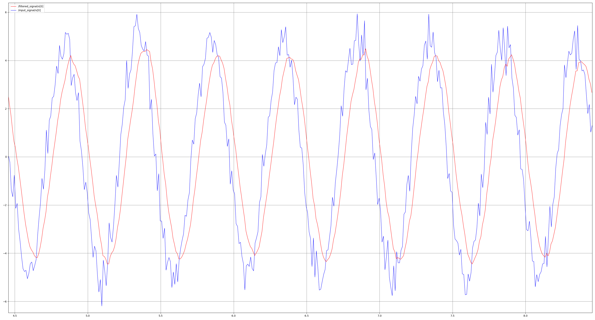
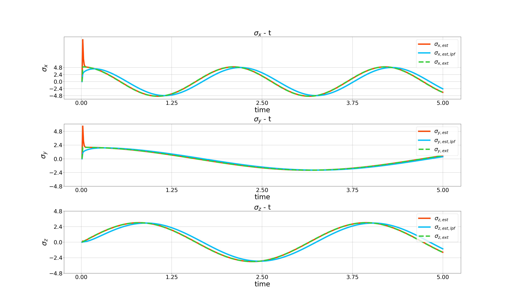
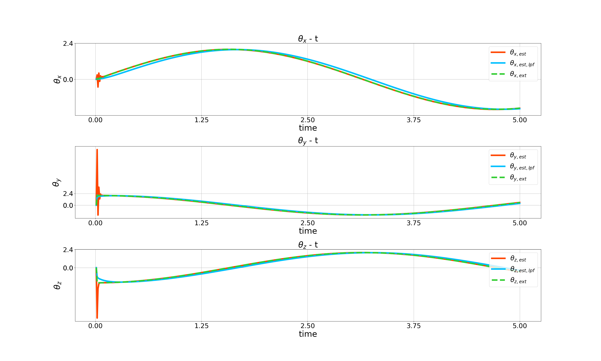
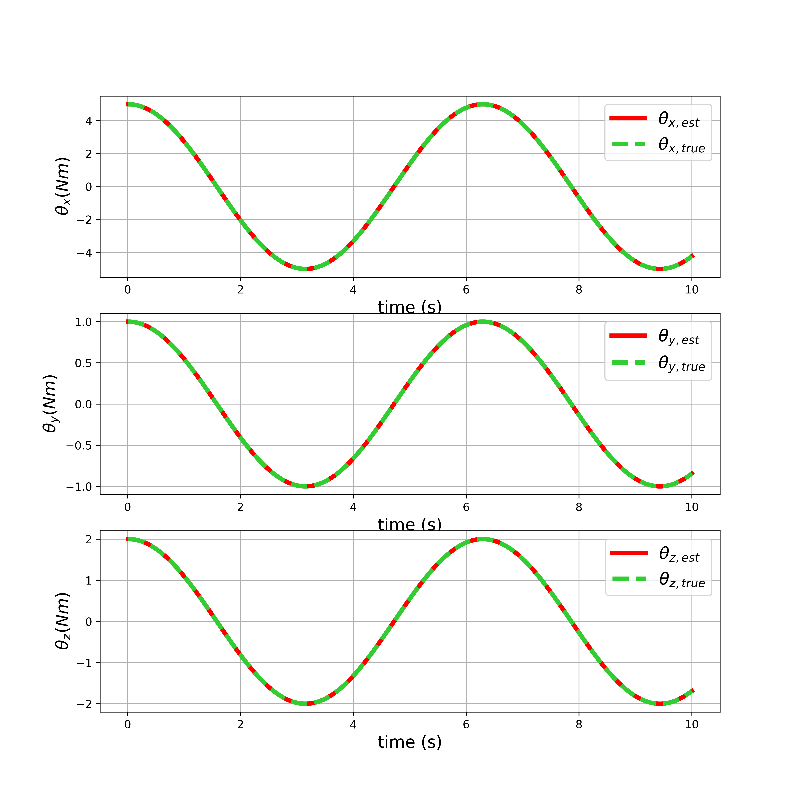

# nmpc_quad

It is of paramount to take frame into account when employing controller.

Frame info:

/hummingbird/ground_truth/odometry

position - world frame,

linear velocity - body frame (Child frame)

quaternion - body to world frame

angular velocity - body frame

By transforming the linear velocity from body frame to world frame, the position controller stability issue is fixed when it reaches the desired yaw.

To do list:

- [ ] Construct message filter to subscribe to /hummingbird/ground_truth/odometry, /hummingbird/imu, and /nmpc_quad/ref topics.

- [x] Fix position control stability when reaching the desired yaw.

https://github.com/kay01-kwon/nmpc_quad/assets/46738866/12070ae6-7412-4a48-b1e3-84e50055672b

quad/assets/46738866/22456794-04a5-4aff-ab14-ad91c27cef27

## Noise information

Magnitude: 5

Standard deviation: 0.5

frequency: 1 Hz

## Low pass filter setup

$\tau$ = 20.0

Continuous low pass filter result is shown below. 

## Translational disturbance estimation result through L1 estimator

## Rotational disturbance estimation result through L1 estimator

But, it is problematic since it only utilizes angular velocity data which is susceptible to bias.

$\omega_{meas} = \omega + \eta_{\omega} + b_{\omega}$

where $\eta_{\omega}$ ~ $\mathcal{N}(0,\sigma_{\eta_{\omega}}^{2})$ and 
$\dot{b_{\omega}}$ ~ $\mathcal{N}(0,\sigma_{b_{\omega}}^2)$.

Thus, quaternion should be used to estimate the disturbance perfectly.

## Rotational disturbance estimation result through optimization based estimator

## To do list (Opt-based rotational disturbance estimator)

- [x] Construct rotational dynamics for simulation.

- [x] Implement the derivative of runge kutta 4th order with respect to $\theta_{est}$.

- [x] Implement newton's method to estimate the orientational disturbance.

- [x] Put differentiation of inerital term with respect to $\theta_{est}$.

- [x] Complete Plot tool class (Size problem -> It does not work)

- [ ] Just implement the simple function code.

- [x] Make the test code, check the error and then fix it.

- [ ] Finally check the time that it takes to compute the iteration.

## Rotational kinematics and dynamics

$`\frac{dq}{dt} = \frac{1}{2} q \otimes 
\begin{bmatrix}
0 \\
\omega
\end{bmatrix} \in \mathbb{C}`$

$\frac{d\omega}{dt} = J^{-1}\left(M - \omega\times J\omega + \theta\right)$

The quaternion multiplication is the following

$`q_{1} \otimes q_{2}
= \begin{bmatrix}
q_{1,w} & -q_{1,x} & -q_{1,y} & -q_{1,z} \\
q_{1,x} & q_{1,w} & -q_{1,z} & q_{1,y} \\
q_{1,y} & q_{1,z} & q_{1,w} & -q_{1,x} \\
q_{1,z} & -q_{1,y} & q_{1,x} & q_{1,w}
\end{bmatrix}
\begin{bmatrix}
q_{2,w} \\
q_{2,x} \\
q_{2,y} \\
q_{2,z}
\end{bmatrix}`$.